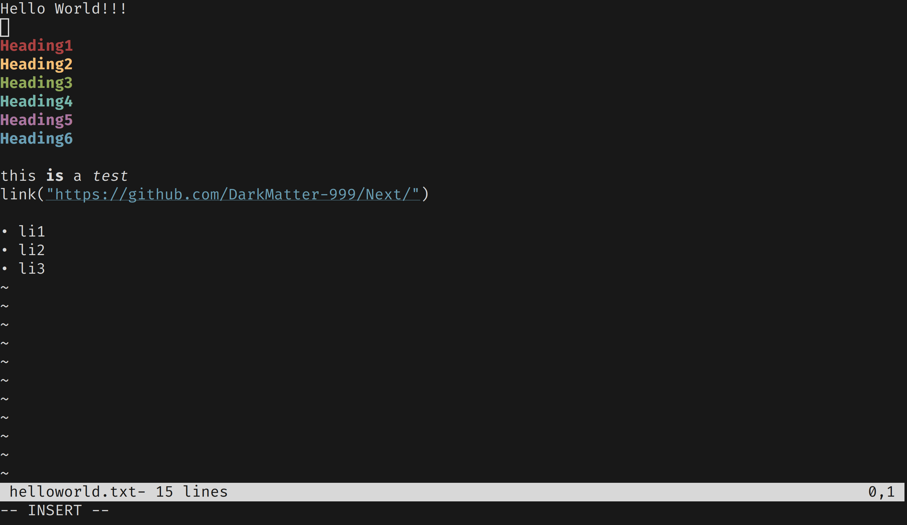

# Next


---

## Features
Next is a Terminal based text editor and note taking application with Markdown support.
Next is built using Rust and supports Vim like navigation and editing.

* **Terminal Based**: Next runs entirely in the terminal, allowing for efficient text editing and note-taking without the need for a graphical interface.
* **Markdown Support**: Next supports Markdown formatting, enabling users to create structured and visually appealing documents.
* **Vim-Like Navigation and Editing**: Inspired by Vim, Next provides intuitive navigation and editing commands for increased productivity.

---
## Building
To build Next, you'll need Rust and Cargo installed on your system. Once you have them set up, you can build Next using Cargo:
```bash
cd Next
cargo build --release
cargo run --release -- #optional file path
```

---

## Contributing
Contributions to Next are welcome! If you encounter any issues or have suggestions for improvements, please feel free to open an issue or submit a pull request on the GitHub repository.
